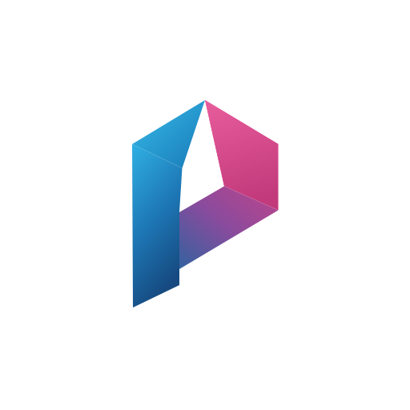

<div align="center">



# prismOS

### A web-centric, ChromiumOS-derived operating system for legacy hardware without SSE4.2

[](https://github.com/Davidix07TV/prismOS/releases)
[](https://github.com/Davidix07TV/prismOS/blob/main/LICENSE)
[](https://github.com/Davidix07TV/prismOS/commits)
[](https://github.com/Davidix07TV/prismOS)

<br/>

[](https://www.gnu.org/software/bash/)
[](kernel/README.md)
[](#floor-isa)
[](docs/waydroid-integration.md)

<br/>

[**Features**](#features) · [**Editions**](#editions) · [**Build**](#build) · [**EDU policy**](#edu-policy) · [**ISA verification**](#isa-verification) · [**FAQ**](#faq) · [**Documentation**](#documentation) · [**Support**](#support-the-project)

</div>

> [!NOTE]
> **prismOS** turns refurbished laptops and desktops from the 2010-2012 era — Intel Pentium
> P6100, Celeron P4500, first-generation Core i3/i5/i7 (Arrandale) — into Chromium-browser
> workstations for classrooms, offices and living rooms, with a macOS-like Ash/Aura
> interface and two compatibility subsystems: **Waydroid** for Android applications and
> **Wine/Proton** for Windows ones.

> [!WARNING]
> **Binding ISA floor** — ARC, ARC++ and ARCVM are removed entirely: on CPUs without
> SSE4.2, Google's Android container enters an **infinite reboot loop** (`zygote` is
> compiled with `-msse4.2 -mpopcnt` and dies with `SIGILL`). For the same reason, official
> Waydroid **x86_64 images must never be used**: prismOS installs only LineageOS 16.0
> **32-bit x86** images with an SSE4.1 floor, marked by the `ISA_FLOOR` file that
> `prismos-waydroid-prepare` checks on every boot.

<div align="center">

<h1><a id="features"></a>Features</h1>

<table>
  <tr>
    <td width="50%" valign="top">

#### SSE4.1 ISA floor, declared and verified
- `CFLAGS`/`CXXFLAGS` `-O2 -pipe -march=nehalem -mno-sse4.2 -msse4.1 -mno-popcnt`
- `CPU_FLAGS_X86` with explicit negation of `sse4_2`, `avx`, `aes`, `popcnt`
- Chromium GN args (`x64_arch="generic"`), Rust `target-cpu=x86-64`, Go `GOAMD64=v1`
- `scripts/verify_legacy_cpu.sh` scans the produced binaries (byte patterns + `objdump`)

</td>
    <td width="50%" valign="top">

#### ARC removed at three levels
- Negative USE flags: `-arc -arc-plus -arcplusplus -arcvm -arc-kernel-features -houdini`
- Profile-wide `use.mask` plus `package.use.mask` on `chromeos-chrome`
- Policies `ArcEnabled=false`, `UnaffiliatedArcAllowed=false` and the `--arc-availability=none` switch

</td>
  </tr>
  <tr>
    <td width="50%" valign="top">

#### Waydroid (Android 9, x86)
- LineageOS 16.0 32-bit x86, `MAINLINE` vendor, `minigbm` gralloc, binderfs
- ART properties `dalvik.vm.isa.x86.variant=x86` with features `-sse4_2,-popcnt,-avx,-avx2`
- `ISA_FLOOR` marker: without it the container **refuses to start**
- Memory budget and `dex2oat` tuned per edition (from 128 MiB / 1 thread on Slim)

</td>
    <td width="50%" valign="top">

#### Wine, Proton and Bottles
- Runs `.exe`/`.msi`/`.dll`/`.scr`/`.cpl`/`.com` straight from the file manager (MIME + BINFMT_MISC)
- Prefix `~/WineBottles/Default` (`WINEARCH=win64`), persistent per-session `wineserver`
- No Vulkan on Intel HD Gen5: `wined3d` backend with Shader Model 3, never DXVK
- fsync/esync on top of kernel 6.1 `futex_waitv`

</td>
  </tr>
  <tr>
    <td width="50%" valign="top">

#### macOS-style dock
- Shelf **at the bottom, centred, always autohiding** — enforced by device policy
- **Squircle** icon mask (superellipse n = 5.0), vector theme with 33 SVGs
- `ShelfAlignment`, `ShelfAutoHideBehavior`, `PinnedLauncherApps`, `WebAppInstallForceList`
- `prismos-dock apply|verify|show|status` to manage and verify the look

</td>
    <td width="50%" valign="top">

#### Central launcher (Spotlight-style)
- `super+space` opens the Ash launcher in search mode, with no Chromium patches
- evdev daemon with exclusive grab and uinput injection of `KEY_SEARCH`
- 12 declarative accelerators in `/usr/share/prismos/accelerators.json`
- `super+ctrl+s` / `super+ctrl+q`: subsystem status and immediate shutdown

</td>
  </tr>
  <tr>
    <td width="50%" valign="top">

#### Five editions
- **EDU**: cloud-managed (Route A) or local-policy (Route B) with URLBlocklist
- **Home**: streaming, Widevine L3, cloud gaming, Proton and Bottles
- **Work**: M365, VPN with kill-switch, LUKS vault for Downloads, Crostini
- **Slim**: under 2 GB of RAM, subsystems installed but **off at boot**, started on demand
- **PRO**: all-in-one single image — the edition is chosen at first setup
  (kernel cmdline `prismos.edition=`, preseed file, or console prompt)

</td>
    <td width="50%" valign="top">

#### Tailored kernel and continuous verification
- Splitconfig `chromiumos-x86_64/prismos_legacy` in 7 fragments (binderfs, BINFMT_MISC, zram/zstd, PSI)
- Scheduler for 2 cores, `INTEL_IOMMU=y` with `DEFAULT_ON=n`, ITCO_WDT
- `verify_legacy_cpu.sh` in the pipeline: IFUNC-dispatched libraries are classified, not failed
- `sync_overlays.sh --check`: 26 consistency checks before every build

</td>
  </tr>
</table>

</div>

---

<div align="center">

<h1><a id="floor-isa"></a>Why SSE4.2 is the problem</h1>

</div>

SSE4.2 introduces seven instructions (`PCMPISTRI`, `PCMPISTRM`, `PCMPESTRI`, `PCMPESTRM`,
`PCMPGTQ`, `CRC32`) plus, as an independent ISA bit, `POPCNT`. A CPU that does not implement
them executes the binary up to the offending instruction, raises `#UD` and receives
`SIGILL`: **there is no fallback**. The problem shows up at four levels, and prismOS guards
all of them:

| Level | Risk | prismOS countermeasure |
|---|---|---|
| System toolchain | `-march=native` or `nehalem` on the build host enables SSE4.2 **and** POPCNT | Fixed `CFLAGS` in `overlay-prismos-common/make.conf` |
| Chromium | GN selects `-march=x86-64-v2/v3` | `x64_arch="generic"`, `use_thin_lto=false` |
| Rust and Go | `target-cpu=nehalem` re-enables `+sse4.2,+popcnt` | `target-cpu=x86-64` with `target-feature=+sse4.1,-sse4.2,-popcnt`; `GOAMD64=v1` |
| Android runtime | ART compiles for the detected CPU variant | 32-bit x86 images and `dalvik.vm.isa.x86.variant=x86` with explicit features |

> [!IMPORTANT]
> `-march=nehalem` is the closest ISA model to Arrandale that GCC can express, but it also
> enables SSE4.2 and POPCNT. **`-mno-sse4.2` does not disable POPCNT**: it must be negated
> explicitly with `-mno-popcnt`. Omitting it yields a system that boots and then dies with
> `SIGILL` inside Chrome or glibc.

---

<div align="center">

<h1><a id="editions"></a>Editions</h1>

</div>

| | **EDU** | **Home** | **Work** | **Slim** | **PRO** |
|---|---|---|---|---|---|
| Audience | labs and classrooms | household use | corporate fleets | machines under 2 GB of RAM | one image, many destinations |
| Minimum RAM | 2048 MiB | 3072 MiB | 3072 MiB | 1024 MiB | 3072 MiB |
| Waydroid at boot | `enabled` | `enabled` | `on-demand` | **`on-demand` (off)** | per the chosen edition |
| Wine at boot | `masked` | `enabled` | `enabled` | **`on-demand` (off)** | per the chosen edition |
| Chromium policy | Route A or B | none | device policy (VPN/anti-anonymity) | none | template of the chosen edition |
| Dock (max pins / default) | 8 / 6, 48 px | 10 / 8, 56 px, blur | 8 / 8, 48 px, opaque | 6 / 6, 40 px, no animations | 10 / 8, 52 px, blur |
| Distinctive trait | ephemeral profiles, guest disabled, social blocked | Widevine L3 (720p ceiling), SIMD SSE4.1 decoding, cloud gaming | pinned M365, VPN kill-switch, LUKS vault | zram zstd, zswap, earlyoom, 120 s idle reaper | edition chosen at first setup by `prismos-edition-setup` |

The functional contract of **Slim**: Waydroid and Wine are *installed* (USE flags on, MIME
types registered, `.desktop` entries present) but their daemons are **completely off at
boot**. Opening an `.apk`/`.xapk` or an `.exe`/`.msi` wakes
`/usr/bin/prismos-slim-launcher`, which starts the subsystem, waits for readiness, launches
the application and — on close — terminates it with `SIGTERM` then `SIGKILL`, cleaning up
mounts, cgroups and temporary prefixes. Only one subsystem at a time is allowed.

Extended comparison, USE flags and per-edition rootfs: [`docs/edizioni.md`](docs/edizioni.md).

---

<div align="center">

<h1><a id="structure"></a>Repository layout</h1>

</div>

```
prismOS/
├── README.md                     this document
├── LICENSE                       MIT, with scope boundaries vs third parties
├── assets/prismos-logo.svg       vector brand mark
├── docs/
│   ├── architecture.md           Portage layering, pipeline, systemd units, runtime layout
│   ├── edizioni.md               extended comparison of the four editions
│   ├── waydroid-integration.md   Android x86 container, ART props, ISA_FLOOR, lifecycle
│   ├── wine-integration.md       Wine/Proton/Bottles on Gen5 without Vulkan, MIME, prefixes
│   └── dock-and-launcher.md      macOS-like shelf, shelf.json, squircle icons, accelerators
├── kernel/chromeos/config/chromiumos-x86_64/prismos_legacy/
│   ├── base.config  prereq.config  fragment.config
│   ├── legacy-cpu.config  android.config  wine.config  slim.config
├── overlays/
│   ├── overlay-amd64-prismos/    amd64-prismos board + rootfs + squircle icon theme
│   ├── overlay-prismos-common/   CFLAGS/USE, eclass, 6 packages, 10 systemd units
│   └── overlay-prismos-{edu,home,work,slim,pro}/   edition profile and rootfs
├── profiles/
│   ├── app_pool.json             25 applications, 5 bundles, ISA and RAM requirements
│   ├── app_pool.schema.json      draft-07 schema with per-type validation
│   └── {edu,home,work,slim,pro}.conf contract read by build_iso.sh
└── scripts/
    ├── build_iso.sh              interactive and unattended build of the five editions
    ├── set_edu_policy.sh         Route A / Route B (Chromium + branded policy paths)
    ├── sync_overlays.sh          --edition --check --list --diff --clean
    ├── verify_legacy_cpu.sh      ISA floor on ELF/PE, rootfs, board, image
    ├── generate_app_icons.sh     squircle theme from app_pool.json
    ├── provision_waydroid_image.sh   conforming Android x86 images
    ├── migrate_from_fydeos.sh    --collect / --restore / --offline FydeOS migration
    ├── setup_runner_host.sh      turn a Linux PC into the prismos-builder runner
    └── lib/                      prismos_common.sh, isa_arc_probe.py
```

---

<div align="center">

<h1><a id="requirements"></a>Requirements</h1>

**Build host**

- GNU/Linux x86-64, kernel ≥ 5.10, **at least 150 GB free** and 8 GB of RAM recommended
- `git`, `curl`, `python3` ≥ 3.8, `tar`, `xz`, `unzip`, `sudo` with access to `mount`/`losetup`
- depot_tools and a complete ChromiumOS checkout with a working `cros_sdk` (kernel **6.1** branch)
- Repository cloned at `~/chromiumos/src/overlays/prismOS` (or linked via `--repo-mount`)

**Target hardware**

- x86-64 CPU **without SSE4.2**: Pentium P6100/P6200, Celeron P4500, Core i3-330M, i5-430M, i7-620M
- First-generation Intel HD Graphics (Ironlake, Gen5): OpenGL 2.1, **no Vulkan**, partial VA-API
- ≥ 1 GB of RAM for Slim, ≥ 2 GB for EDU, ≥ 3 GB for Home and Work
- Legacy BIOS or UEFI firmware (both GRUB paths are in the image)

</div>

---

<div align="center">

<h1><a id="build"></a>Build</h1>

<table>
  <tr>
    <th align="center">Interactive build</th>
    <th align="center">Unattended build</th>
  </tr>
  <tr>
    <td align="center">
      <pre><code>cd ~/chromiumos/src/overlays/prismOS
./scripts/build_iso.sh slim \
    --sdk-dir ~/chromiumos/cros_sdk</code></pre>
    </td>
    <td align="center">
      <pre><code># edition default bundle
./scripts/build_iso.sh home --bundle --jobs 8

# explicit selection from the pool
./scripts/build_iso.sh edu --apps 1,3,5-7

# all-in-one image, edition chosen at first setup
./scripts/build_iso.sh pro --bundle

# all five editions in sequence
./scripts/build_iso.sh all --bundle

# overlay synchronization only
./scripts/build_iso.sh work --sync-only</code></pre>
    </td>
  </tr>
</table>

The interactive menu lists the pool applications with their type (`Web_App`,
`Android_Pkg`, `Windows_Pkg`) and marks those already provided by the bundle; the selection
accepts lists and ranges (`1,3,5-7`, `all`, `none`).

Stages: generation of `shelf.json` and `edition.conf` → overlay synchronization into the
`cros_sdk` → `setup_board` → `build_packages` → `build_image
--noenable_rootfs_verification dev` → collection into
`output/prismOS_<edition>_legacy.img` → ISA-floor verification of the critical sysroot
binaries.

**Produced artifacts**

| Path | Content |
|---|---|
| `output/prismOS_<edition>_legacy.img` | bootable disk image |
| `output/prismOS_<edition>_legacy.img.info` | board, kernel, ISA, selected apps, SHA-256 |
| `output/prismOS_<edition>_legacy.shelf.json` | dock configuration used by the build |
| `output/prismOS_<edition>_legacy.edition.conf` | embedded subsystem state |
| `output/prismOS_<edition>_legacy.isa-report.{txt,json}` | ISA-floor verification report |
| `build/logs/build-<edition>-<timestamp>.log` | complete build log |

Main options: `--sdk-dir`, `--board`, `--jobs`, `--apps`, `--bundle`,
`--image-type dev|base|test`, `--policy-mode local|cloud|none`, `--copy-overlays`,
`--no-sync`, `--sync-only`, `--skip-verify`, `--keep-build`, `--dry-run`, `--verbose`.
`./scripts/build_iso.sh --help` lists them all.

**Build in CI — GitHub Actions**

The [`build-prismos`](.github/workflows/build-prismos.yml) workflow has two
jobs: `validate` (free GitHub runners: syntax, JSON schema, ISA floor, the
pre-compilation pipeline of all five editions against a stub `cros_sdk`) and
`build` (a self-hosted runner with the `prismos-builder` label). Compiling
ChromiumOS needs ≥ 150 GiB of disk and ≥ 8 GiB of RAM, so a standard GitHub
runner cannot do it; prepare your build PC once with:

```bash
./scripts/setup_runner_host.sh --token <REGISTRATION_TOKEN>
```

then run **Actions → build-prismos → Run workflow** with `edition=pro`,
`runner_label=prismos-builder` and `chromiumos_path=/opt/chromiumos`.
Full guide: [`docs/build-runner.md`](docs/build-runner.md).

</div>

---

<div align="center">

<h1><a id="edu-policy"></a>School policy (EDU)</h1>

</div>

#### Route A — Cloud-Managed

The device enrolls into the school's Google Admin Console. Only Enterprise Enrollment
switches actually recognized by Chromium are written to `/etc/default/chromium-browser`:

```bash
./scripts/set_edu_policy.sh --strada a --domain liceo-fermi.edu \
    --rootfs /build/amd64-prismos
./scripts/set_edu_policy.sh --strada a --domain liceo-fermi.edu \
    --dm-modulus <base64> --dm-modulus-length 2048 --with-domain-policy
```

No local JSON policy is installed: device policies would take precedence over cloud ones.

#### Route B — Local-Policy

No Google infrastructure at all: the policy is written to
`/etc/chromium/policies/managed/prismos_policy.json` (mirrored to
`/etc/opt/chrome/policies/managed/` for branded builds such as FydeOS and
Chrome-branded ChromiumOS) from the template
`overlays/overlay-prismos-edu/chrome_policy.json` (81 keys), with a **URLBlocklist**
covering TikTok, YouTube and Twitch (CDNs, shorteners and related domains), a
**URLAllowlist** covering the school domain, ministerial services, Workspace for Education,
Geogebra, Canva, Wikipedia, Khan Academy, Scratch and F-Droid, and a `UserAllowlist` on
`*@<domain>`.

```bash
./scripts/set_edu_policy.sh --strada b --domain ic-manzi.edu \
    --allowlist "*://web.spaggiari.eu/* *://*.indire.it/*"
./scripts/set_edu_policy.sh --strada b --domain ic-manzi.edu \
    --blocklist "*://*.roblox.com/*" --all-users
./scripts/set_edu_policy.sh --show        # installed summary
./scripts/set_edu_policy.sh --validate    # syntax, conflicts, ARC keys
./scripts/set_edu_policy.sh --remove      # back to pure Route A
```

Since in Chromium the URLAllowlist takes precedence over the URLBlocklist, the script
automatically drops any allowed entry falling inside a blocked domain and records it in the
log.

---

<div align="center">

<h1><a id="subsystems"></a>Compatibility subsystems</h1>

<table>
  <tr>
    <th align="center">Waydroid — Android 9 x86</th>
    <th align="center">Wine — Windows applications</th>
  </tr>
  <tr>
    <td>
      <pre><code>sudo ./scripts/provision_waydroid_image.sh \
     --edition slim

sudo ./scripts/provision_waydroid_image.sh \
     --edition edu \
     --archive ~/lineage-16.0-x86.zip \
     --deep-verify

sudo ./scripts/provision_waydroid_image.sh \
     --edition work --build \
     --source-dir ~/lineageos-16.0</code></pre>
    </td>
    <td>
      <pre><code>prismos-wine-run \
    ~/Downloads/npp.Installer.exe \
    --prefix Default -- /S

prismos-wine-run --list-prefixes
wineserver -k

# on Slim everything goes through:
prismos-slim-launcher start wine
prismos-slim-launcher stop-all
prismos-slim-launcher doctor</code></pre>
    </td>
  </tr>
</table>

Waydroid provisioning downloads (with resume and SHA-256), extracts `system.img`/`vendor.img`
into `/var/lib/waydroid/images`, installs the ISA-floor ART properties, verifies that no
64-bit ABI is exposed and writes the `ISA_FLOOR` marker; with `--deep-verify` it mounts the
image read-only and scans it with `verify_legacy_cpu.sh --rootfs --full`. ARM translation
is disabled (it requires SSE4.2): the pool therefore selects F-Droid packages with native
x86 ABI.

Wine detects at runtime whether a Vulkan ICD exists: on Gen5 there is none, so the backend
is always `wined3d` (OpenGL 2.1 via `crocus`, Shader Model 3, 64 MiB of declared VRAM,
multisampling disabled). Proton and Bottles remain available on editions with enough RAM;
EDU masks Wine, Slim excludes Bottles.

Deep dives: [`docs/waydroid-integration.md`](docs/waydroid-integration.md) and
[`docs/wine-integration.md`](docs/wine-integration.md).

</div>

---

<div align="center">

<h1><a id="kernel"></a>Kernel</h1>

</div>

The `chromiumos-x86_64/prismos_legacy` splitconfig is copied by `build_iso.sh` into
`src/third_party/kernel/v6.1/chromeos/config/chromiumos-x86_64/` and selected through
`CHROMEOS_KERNEL_SPLITCONFIG` in the board `make.conf`.

| Fragment | Essential content |
|---|---|
| `base.config` | ordered list of fragments to concatenate |
| `prereq.config` | configuration dependencies (cgroups, namespaces, netfilter, crypto) |
| `fragment.config` | DRM_I915 and Gen5 (crocus/i965), HDA, networking, filesystems, SELinux |
| `legacy-cpu.config` | 2-core scheduler, no AVX/AES-NI, `INTEL_IOMMU=y` with `DEFAULT_ON=n`, ITCO_WDT |
| `android.config` | `ANDROID_BINDER_IPC`, binderfs, namespaces, cgroup v2, DMA-BUF |
| `wine.config` | `BINFMT_MISC`, fsync/esync, THP `madvise`, zswap, gamepads |
| `slim.config` | zram/zstd, PSI, memcg, tracers off but `BPF_SYSCALL=y` (Chrome sandbox) |

Details and rationale for every entry: [`kernel/README.md`](kernel/README.md).

---

<div align="center">

<h1><a id="isa-verification"></a>ISA verification</h1>

```bash
./scripts/verify_legacy_cpu.sh --host              # ISA capabilities of the current machine
./scripts/verify_legacy_cpu.sh --config            # repository consistency
./scripts/verify_legacy_cpu.sh --pe ~/setup.exe    # single binary (ELF or PE)
./scripts/verify_legacy_cpu.sh --board amd64-prismos --full
./scripts/verify_legacy_cpu.sh --image output/prismOS_slim_legacy.img \
    --report output/isa.txt --json output/isa.json
```

The method runs in two phases: byte-pattern search (fast, no disassembler) followed by
`objdump` confirmation on candidates only. Libraries with IFUNC dispatch — glibc, OpenSSL,
zlib, LLVM/Mesa, DRI drivers — legitimately contain SSE4.2 paths selected at runtime and are
classified as `dispatched`: they are **not** failures. Evidence on `chrome`, Wine, Waydroid
and the prismOS packages is fatal instead, since those are compiled with a fixed `-march`.

Exit codes: `0` conforming · `1` non-conforming · `2` usage error.

</div>

---

<div align="center">

<h1><a id="installation"></a>Installing on real hardware</h1>

```bash
# inside the chroot, with the USB stick connected
cros flash usb:// ~/chromiumos/src/overlays/prismOS/output/prismOS_slim_legacy.img

# or, from a booted Linux system
sudo dd if=prismOS_slim_legacy.img of=/dev/sdX bs=8M status=progress conv=fsync

# from Windows: balenaEtcher ("Flash from file") or Rufus in DD-image mode
# (never ISO mode: the image must be written sector by sector)
```

On the target: disable Verified Boot (`dev` images are born with
`--noenable_rootfs_verification`; on ChromeOS firmware you additionally need
`make_dev_ssd.sh --remove_rootfs_verification`), complete the OOBE and, for Waydroid, run
`provision_waydroid_image.sh` once. Images include `dev_install`, sudo and a developer
shell; for a variant without development tools use `--image-type base`.

**Migrating from FydeOS**

FydeOS' Android subsystem requires SSE4.2 officially, so on pre-2011 CPUs it
is exactly what prismOS replaces. To keep the user data:

```bash
# 1. on FydeOS, logged in as the user to migrate (crosh -> shell)
./scripts/migrate_from_fydeos.sh --collect          # bundle + manifest + SHA256

# 2. copy the bundle to a USB stick, install prismOS, complete the first login

# 3. on prismOS
./scripts/migrate_from_fydeos.sh --restore /media/<usb>/prismos-migration-*.tar.gz
```

Files, wallpapers, PWA metadata and bookmarks travel; credentials never do
(they are bound to the FydeOS account key — export passwords or use Google
sync before wiping). `--offline MOUNTPOINT` recovers whatever is outside the
encrypted cryptohome vaults from a mounted stateful partition.

</div>

---

<div align="center">

<h1><a id="troubleshooting"></a>Troubleshooting</h1>

| Symptom | Likely cause | Remedy |
|---|---|---|
| `SIGILL` when Chrome starts | POPCNT enabled by `-march=nehalem` | add `-mno-popcnt` in `overlay-prismos-common/make.conf` and rebuild `chromeos-chrome` |
| Waydroid container rebooting forever | x86_64 images or `isa.x86.variant=nehalem` | `provision_waydroid_image.sh --force` with an x86 source; check `ISA_FLOOR` |
| `binder: failed to open` | binderfs not enabled or not mounted | check `android.config`; `mount -t binder none /dev/binderfs` |
| Black screen or software rendering | wrong Mesa driver (`iris`/`zink`) | `MESA_LOADER_DRIVER_OVERRIDE=crocus`, `LIBVA_DRIVER_NAME=i965`, `LIBGL_DRI3_DISABLE=1` |
| DRM video at 480p or 720p | Widevine L3 on uncertified platform | expected behaviour: the L1 level is not available |
| Dock not centred or visible | dock policy missing | `prismos-dock status && prismos-dock verify` |
| `super+space` does nothing | daemon without evdev access | `systemctl status prismos-accelerator-daemon`, `input` group, `/dev/uinput` |
| Slim: `.exe` does not open | subsystem not installed or masked | `prismos-slim-launcher doctor`; check `WINE_BOOT_STATE` in `/etc/prismos/edition.conf` |
| `setup_board` fails | overlays not synchronized or wrong `parent` | `sync_overlays.sh --check` |
| Very slow build or OOM on the build host | excessive parallelism | `--jobs 2`; the Slim edition enables `single-thread-link` |

</div>

---

<div align="center">

<h1><a id="faq"></a>FAQ</h1>

### Why isn't disabling ARC in the settings enough?
Because the code is already compiled with SSE4.2: `zygote` dies with `SIGILL` before any
policy is read. ARC must be removed from packages, profile and policies — which is exactly
what prismOS does at three independent levels.

### Can I install ARM Android applications?
No. ARM translation (houdini, libndk_translation) requires SSE4.2/POPCNT. The pool selects
F-Droid packages with native x86 ABI or pure-Java ones; ARM-only applications cannot be
installed and `app_pool.json` declares that with `arm_translation_required: false`.

### Do Windows games work?
Light ones do, through `wined3d` on OpenGL 2.1 with Shader Model 3: 2D titles, isometric
games and early-2000s 3D. DXVK and VKD3D-Proton require Vulkan, which Intel HD Gen5 lacks.
For modern titles the recommended path is cloud gaming (GeForce NOW, Xbox Cloud) via the
browser.

### Which edition for a netbook with 1 GB of RAM?
**Slim**: Chromium and Ash get absolute priority, Waydroid and Wine exist but consume no
memory until you open a compatible file, and zram zstd + earlyoom protect the session from
the kernel OOM killer.

### What exactly is the PRO edition?
A single image that compiles in every targeted capability and defers the decision to
first setup: `prismos-edition-setup` (run before `prismos-firstboot`) reads
`prismos.edition=` from the kernel command line, or `/etc/prismos/edition-choice`, or
asks on the console with a 60 s timeout, then copies the template of the chosen edition
(`edition.conf`, tuning files, device policy where defined) over `/etc`. From that moment
the machine behaves exactly like a native build of that edition. `--rechoose` asks again
at the next boot.

### My school has no Google Admin Console: can I still use EDU?
Yes, with **Route B**: the device policy is written locally to
`/etc/chromium/policies/managed/prismos_policy.json`, blocking TikTok/YouTube/Twitch and
allowlisting the school domain, with no Google infrastructure whatsoever.

### Is 4K video streaming possible?
No: on an uncertified platform Widevine operates at level L3 (720p ceiling) and decoding
happens in software with SSE4.1 SIMD, because on Ironlake the VA-API H.264 path is not
reliable. This is a hardware limit, not a fixable configuration.

</div>

---

<div align="center">

<h1><a id="documentation"></a>Documentation</h1>

| Document | Content |
|---|---|
| [`docs/architecture.md`](docs/architecture.md) | Portage layering, build pipeline, systemd units, runtime layout, extending the project |
| [`docs/edizioni.md`](docs/edizioni.md) | extended comparison of the four editions: USE, packages, rootfs, dock, memory |
| [`docs/waydroid-integration.md`](docs/waydroid-integration.md) | Android x86 container, ART properties, `ISA_FLOOR` marker, unit lifecycle |
| [`docs/wine-integration.md`](docs/wine-integration.md) | Wine/Proton/Bottles on Gen5 without Vulkan, MIME types, prefixes, kernel |
| [`docs/dock-and-launcher.md`](docs/dock-and-launcher.md) | macOS-like shelf, `shelf.json`, policies, squircle theme, global accelerators |
| [`docs/build-runner.md`](docs/build-runner.md) | self-hosted runner: requirements, setup, CI builds, maintenance, security |
| [`kernel/README.md`](kernel/README.md) | kernel splitconfig and the rationale of every fragment |
| `./scripts/<name>.sh --help` | complete reference of each tool |

</div>

---

<div align="center">

<h1><a id="support-the-project"></a>Support the project</h1>

<h3>prismOS is free software. If it helps you, please consider contributing!</h3>

#### Star the repository ⭐
If prismOS gives a second life to a machine you had set aside, a star on GitHub helps the project get found.

#### Report issues and suggest improvements 🐛
Unsupported hardware, failed build, policy to add? [Open an issue](https://github.com/Davidix07TV/prismOS/issues).

#### Contribute code and configuration 💻
Pull requests are welcome: complete bash 5 scripts (no placeholders), explicit ISA flags at
every compilation level and thorough documentation are the three criteria they are reviewed
against.

</div>

---

<div align="center">

<h1>Credits and attribution</h1>

<h3>prismOS exists thanks to the work of the following projects.</h3>

<table>
  <thead>
    <tr>
      <th align="center">Project</th>
      <th align="center">Role in prismOS</th>
    </tr>
  </thead>
  <tbody>
    <tr>
      <td align="center"><a href="https://www.chromium.org/chromium-os"><strong>ChromiumOS</strong></a></td>
      <td>base system: kernel, Ash/Aura, build toolchain, device policies</td>
    </tr>
    <tr>
      <td align="center"><a href="https://www.gentoo.org"><strong>Gentoo / Portage</strong></a></td>
      <td>profiles, overlays, eclasses and dependency resolution</td>
    </tr>
    <tr>
      <td align="center"><a href="https://waydro.id"><strong>Waydroid</strong></a></td>
      <td>Android container on a mainline kernel with binderfs</td>
    </tr>
    <tr>
      <td align="center"><a href="https://lineageos.org"><strong>LineageOS</strong></a></td>
      <td>base of the Android 9 x86 images rebuilt with the SSE4.1 floor</td>
    </tr>
    <tr>
      <td align="center"><a href="https://www.winehq.org"><strong>Wine</strong></a> and <a href="https://github.com/ValveSoftware/Proton"><strong>Proton</strong></a></td>
      <td>execution of Windows applications and prefixes managed by Bottles</td>
    </tr>
    <tr>
      <td align="center"><a href="https://mesa3d.org"><strong>Mesa</strong></a></td>
      <td>`crocus` and `i965` drivers for first-generation Intel HD Graphics</td>
    </tr>
    <tr>
      <td align="center"><a href="https://linuxcontainers.org"><strong>LXC</strong></a></td>
      <td>isolation of the Android container with partial namespaces</td>
    </tr>
    <tr>
      <td align="center"><a href="https://f-droid.org"><strong>F-Droid</strong></a></td>
      <td>channel for the native-x86 Android applications selected in the pool</td>
    </tr>
  </tbody>
</table>

The icons generated by `scripts/generate_app_icons.sh` are original vector placeholders
(text glyph on a squircle background) and do **not** reproduce the official logos of the
cited applications. All trademarks belong to their respective owners.

</div>

---

<div align="center">

## License

The original prismOS code and configuration — scripts, overlays, profiles, systemd units,
kernel splitconfig, icon theme and documentation — are released under the
[MIT license](LICENSE), which explicitly delimits its scope with respect to the third-party
components embedded in an image (ChromiumOS, Gentoo, the Linux kernel, Waydroid, LineageOS,
Wine, Mesa, LXC), each subject to its own license. Widevine is a Google DRM module
distributed exclusively through the channels provided by ChromiumOS.

### Disclaimer
This project is not affiliated with Google, ChromiumOS, Intel, Microsoft or the owners of
the cited trademarks. Use on specific hardware is at the user's own risk: always verify the
ISA floor with `verify_legacy_cpu.sh` before deploying to production.

---

**Repository**: https://github.com/Davidix07TV/prismOS

**Last updated**: September 2026

</div>
